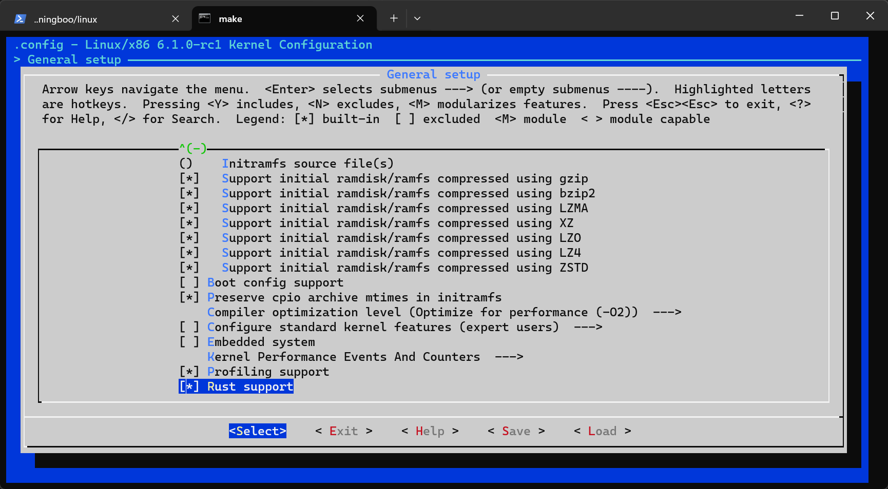
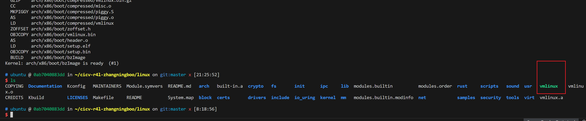

# 作业1：编译Linux内核
作业说明：
进入Linux文件夹，使用如下命令进行编译：
```shell
make x86_64_defconfig
make LLVM=1 menuconfig
#set the following config to yes
General setup
        ---> [*] Rust support
make LLVM=1 -j$(nproc)
```
在最后你将在Linux文件夹下，得到一个vmlinux的文件，那么就算成功了

- 设置Rust Support

- 编译内核


# 作业2：对Linux内核进行一些配置

- 1、编译成内核模块，是在哪个文件中以哪条语句定义的？

- 2、该模块位于独立的文件夹内，却能编译成Linux内核模块，这叫做out-of-tree module，请分析它是如何与内核代码产生联系的？
